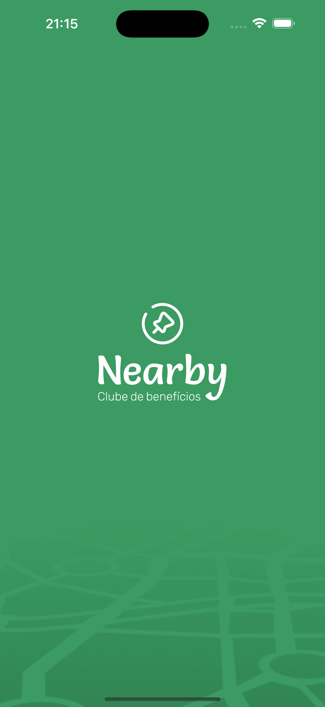
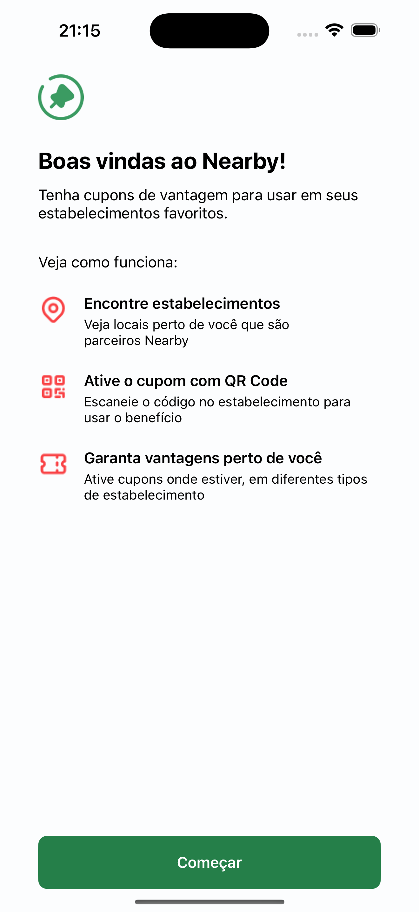
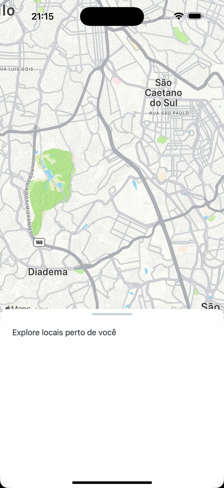

<h2 align="center">
    NLW Pocket Mobile • Nearby
</h2>

## NLW Pocket Mobile Swift 📱

Evento NLW Pocket Mobile Swift, uma aplicação Nearby desenvolvida para proporcionar um clube de benefícios exclusivo, focada em oferecer uma experiência mobile moderna e eficiente.

Este projeto foi criado durante o evento Next Level Week (NLW) da Rocketseat, utilizando Swift e SwiftUI para o desenvolvimento nativo de iOS. A aplicação permite que os usuários explorem e aproveitem benefícios personalizados de maneira simples e intuitiva.

## Objetivo 🎯

O objetivo da aplicação é oferecer uma plataforma para que usuários possam acessar promoções, descontos exclusivos e benefícios especiais de parceiros diretamente pelo aplicativo, de forma prática e organizada.

## Como Executar 📱

<div style="display: flex; justify-content: space-around;">
    
    
    
</div>

## Como Executar 📋

1. Clone o repositório:

```bash
    $ git clone https://github.com/SilvaneiMartins/nearby-swift
```

2. Abra o projeto no Xcode.

3. Instale as dependências utilizando o CocoaPods (se aplicável).

```bash
    $ pod install
```

## Contribuindo 💡

Contribuições são bem-vindas! Sinta-se à vontade para abrir uma issue ou enviar um pull request.

## Licença 📝

Este projeto é licenciado sob [CC0 1.0 Universal]. Consulte o arquivo [LICENSE](https://github.com/SilvaneiMartins/nearby-swift/blob/master/LICENSE) para obter detalhes.

## Contato 📩

<a href="https://github.com/SilvaneiMartins">
    
    <br />
    <sub>
        <b>Silvanei de Almeida Martins</b>
    </sub>
</a>
     <a href="https://github.com/SilvaneiMartins" title="Silvanei martins" >
 </a>
<br />
🚀 Feito com ❤️ por Silvanei Martins
